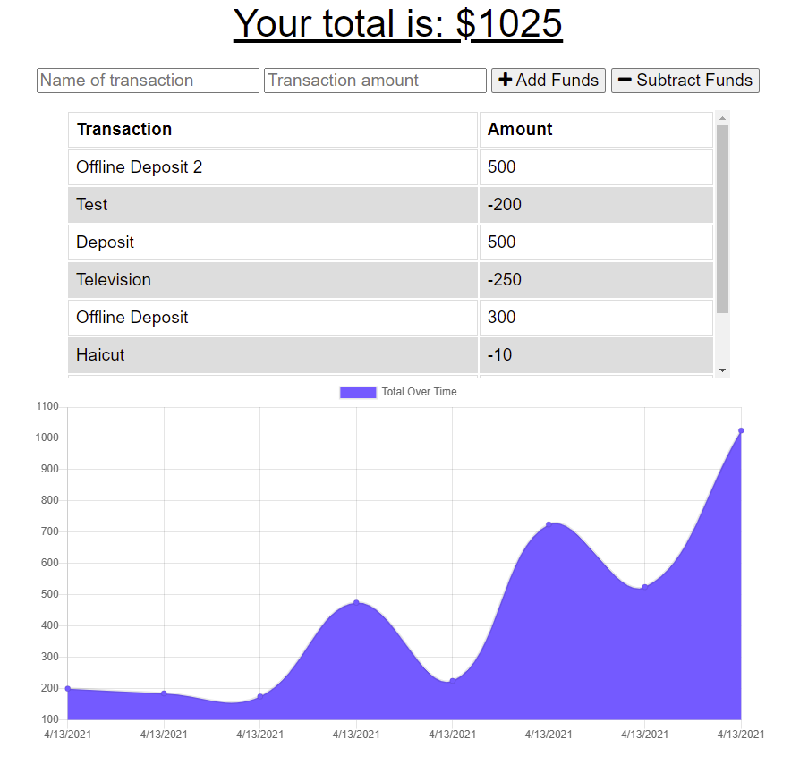

# Budget Tracker

## Description
    
Budget tracker is a progressive web application allowing users to enter deposits and expensives both online & offline created with MongoDB, Node, & Express

## Table of Contents

* [Installation](#installation)
* [Usage](#usage)
* [Preview](#preview)
* [Deployed Application](#deployed-application)
* [Questions](#questions)

## Installation

#### Prerequisites

* [MongoDB](https://docs.mongodb.com/manual/installation/)
* [Node.js](https://nodejs.org/en/download/)

Download the project and run `npm i` in the directory to install the required npm packages.

## Usage

Run `npm start` to start the application and visit `http://localhost:3000` in browser to view it.

The forms at the top will allow you to enter a transation name + amount, then adding or subtracting funds will adjust the total amount and reflect it on the graph below.

Should you go offline, you can still freely use the application, and any transactions will be added upon reconnect.

## Preview

## Deployed Application

A demo of this application is deployed live on Heroku

https://budget-tracker768.herokuapp.com/

## Questions

If you have any questions, you can reach me through my github or email below

Github: [LinosM](https://github.com/LinosM)

Email: [NguyenDuy768@gmail.com](mailto:NguyenDuy768@gmail.com)
